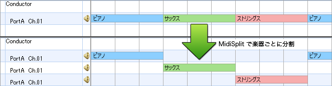

MidiSplit
=========

Split MIDI tracks for each program number (instruments).

MidiSplit is effective for relocating tracks of a sequence that has only a limited number of channels (e.g. retrogame BGM). Such a sequence often changes instrument by a program change several times in a track. MidiSplit helps you to know how many instruments are used, and adjust volume balance for each instruments.

Note
------------------------

- MidiSplit splits track when it finds a program change. Channel messages excluding notes (e.g. control changes) located before the program change, will also be moved to the new track.
    - By `-cs` option, MidiSplit can copy control changes, that are located in other tracks, to switching point.
- Non-channel messages (e.g. sysex) will be kept in the input track.
- Rhythm channel is processed as same as a melody channel.
    - By `-sp` option, MidiSplit can divide a melody into tracks by note numbers. (example: `-sp "ch10, prg127:0:1"`)
